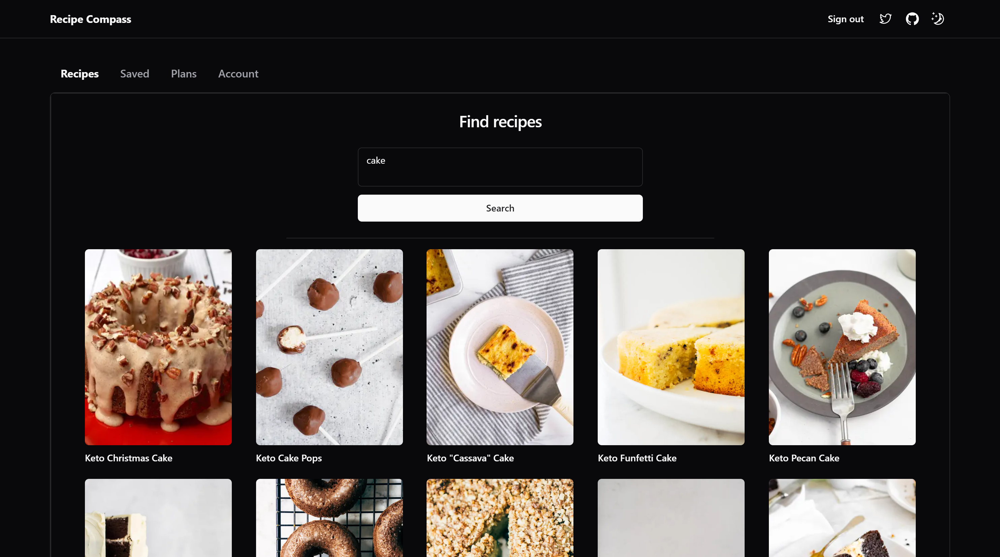
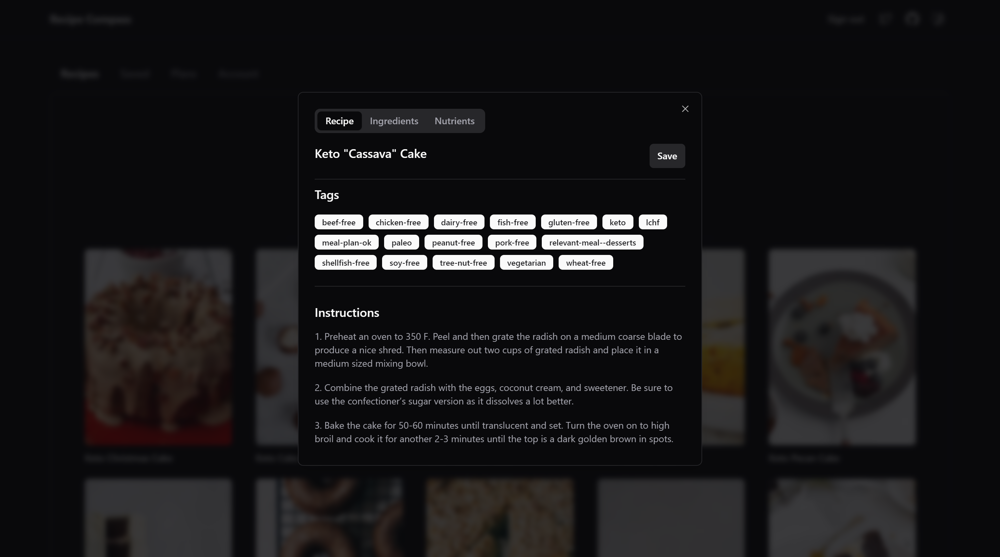
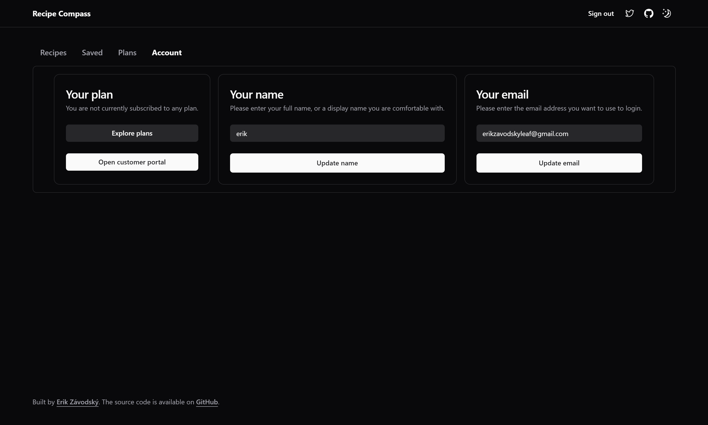

# Full-stack SaaS Demo App

Note: Live version on Vercel currently does not work because I'm on the free Supabase plan and need to use the limited number of projects/DBs for other purposes.

## Features

This demo app is a full-stack recipe SaaS app. It is not meant to be an actual SaaS app, but rather a demo of how one could be built. The 'product' here is the ability to search for recipes. The "free" version allows a limited number of recipe searches, and "paid" versions allow a higher number of recipe searches.

However, this app could easily be modified so that the "subscription" is for something else, like the ability to create, save, or share recipes with friends.

> Why such a long and detailed README.MD?

- Because when I was learning how to do this just recently, I felt like I had to stitch together a bunch of different tutorials, docs and repos to get a working app. What I mean is the kind of working app whose setup, deployment, patterns and logic can be easily understood, and one can get to building/modifying things further without too much friction. **While it is my intention to make it easier for others in this regard, I do not claim to be an expert in any of the technologies used here**. I'm sure there are better ways to do things, and I'm open to suggestions. I'm also open to contributions, so feel free to open a PR if you think something can be improved.

**Here are some features**:

- User management and authentication with Supabase
- Data access & management tooling on top of PostgreSQL with Supabase
- Integration with Stripe Checkout and the Stripe customer portal
- Automatic syncing of pricing plans and subscription statuses via Stripe webhooks
- Fetching recipes from an external API and displaying it in the app
- Saving any of the recipes retrieved from the search
- Deleting any of the already saved recipes
- Using server actions for everything except Stripe and fetching recipes
- shadcn ui (yes, that _is_ a feature)






## Local setup

Clone the repo and install dependencies:

```
npm install
```

### Supabase env variables

Clone the `.env.example` file and rename it to `.env`. For the first step, fill in the Supabase environment variables. You can find these in your Supabase project settings.

### Supabase database setup

Copy the contents of `schema.sql`. Go to your project -> SQL editor -> paste and run. This should create the following tables in your Supabase database: `customers`, `prices`, `products`, `subscriptions`, `user_api_limit`, `user_recipes`, `users`.

All tables except `user_api_limit` and `user_recipes` are those you'd get if you ran the `Stripe Subscriptions` starter template in Supabase. The `user_api_limit` table is used to keep track of how many API calls to an external API a user has made, and the `user_recipes` table is used to keep track of which recipes a user has saved. These two tables were created specifically for this demo app.

### Stipre environment variables

Once you've set up your Supabase database, you'll need to set up your Stripe environment variables. You can find `NEXT_PUBLIC_STRIPE_PUBLISHABLE_KEY` under `Publishable key` and `STRIPE_SECRET_KEY` under `Secret key` in your Stripe dashboard. To retrieve the `STRIPE_WEBHOOK_SECRET`:

- Navigate to your Stripe dashboard. In the search bar, type `webhooks` and go to `Developers > Webhooks` -> `Test in a local environment`
- Open two concurrent terminal windows.
- In the first terminal window, run `npm run dev`.
- In the second terminal window, run `stripe login` and follow the auth flow. Then return to your terminal.
  - If you haven't already, [install the Stripe CLI](https://stripe.com/docs/stripe-cli) and [link your Stripe account](https://stripe.com/docs/stripe-cli#login-account)
- In the window where you ran `stripe login`, run `stripe listen --forward-to localhost:3000/api/webhooks` (replace the port with whatever you're using). If you followed the steps above, you should see a webhook secret (`whsec` prefix) printed in your terminal. Copy and paste it in the place of `STRIPE_WEBHOOK_SECRET` in your `.env` file.
- To check the configuration, run `stripe trigger payment_intent.succeeded`. You should see a bunch of responses in your terminal with `200` status codes.

### Recipe API

Get your API key from [Low Carb Recipes](https://rapidapi.com/dfskGT/api/low-carb-recipes) and paste it in the place of `RAPID_API_KEY` in your `.env` file.

### Creating a Stripe product

> **Important**: If you're developing locally, make sure the development server (`npm run dev`) and Stripe webhook forwarding (`stripe listen --forward-to localhost:3000/api/webhooks`) are running concurrently in two separate terminals like in the section above. Otherwise, interactions with Stripe (creating a product, purchasing a subscription, etc.) will work in Stripe, but they won't be reflected in your Supabase database.

Navigate to your Stripe dashboard -> Products -> Add product. For this demo, I recommend creating a simple product, meaning one with a standard pricing model, one currency, one price, and without metered usage. If everything is set up correclty, you should see the product you created in your Supabase database.

## Deployment (with Stripe test mode)

- Deploy the app to Vercel like you normally would with all your .env variables
- Copy the domain that Vercel assigned to you (e.g. https://yourwebsite.vercel.app/)

### Stripe

- Go to your Stripe dashboard -> `webhooks` -> `add an endpoint`
- Set `Endpoint URL` to `https://yourwebsite.vercel.app/api/webhooks`
- `Select events to listen to` -> `select all events` (or just those you need)
- `Add endpoint`

After this, you should be redirected to a page where you'll find 'Signing secret`. Copy and paste it in the place of `STRIPE_WEBHOOK_SECRET`in your`.env` file. Then, redeploy the app to Vercel.

### Supabase

Dashboard -> `Authentication` -> `URL Configuration` -> put your domain assigned by Vercel in `Site URL`

## Deployment (with Stripe live mode)

[Instructions/notes below borrowed from this repo](https://github.com/vercel/nextjs-subscription-payments)

### Archive testing products

Archive all test mode Stripe products before going live. Before creating your live mode products, make sure to follow the steps below to set up your live mode env vars and webhooks.

### Configure production environment variables

To run the project in live mode and process payments with Stripe, switch Stripe from "test mode" to "production mode." Your Stripe API keys will be different in production mode, and you will have to create a separate production mode webhook. Copy these values and paste them into Vercel, replacing the test mode values.

### Redeploy

Afterward, you will need to rebuild your production deployment for the changes to take effect. Within your project Dashboard, navigate to the "Deployments" tab, select the most recent deployment, click the overflow menu button (next to the "Visit" button) and select "Redeploy" (do NOT enable the "Use existing Build Cache" option).

To verify you are running in production mode, test checking out with the Stripe test card. The test card should not work.

## Developing locally

The following section servers to explain the structure and/or logic of the app so that you can spend less time understanding/bug-fixing and more time modifying it to your needs.

### Types

- I'm keeping the Supabase database types in `types_db.ts`. If you make any changes to the database, make sure to update the types by following this [guide](https://supabase.com/docs/guides/api/rest/generating-types).
- The types in `types.ts` store the types for recipe data as well as some `helper` types that relate to the Supabase database (e.g. `Product` or `Price`).

### Middlware

The structure of `middleware.ts` is slightly different from the default ones you see (like in Supabase docs). The few changes I made are:

- A check to see if a user is **not** logged in and the currentl URL is not root (`/`). If both are true, users are redirected to the `sign-in` page. This is because most SaaS app have a homepage that is accessible to everyone, even if they're not logged in.
- A check to see if a user is logged in and the current URL is root (`/`). If both are true, users are redirected to the `recipes` page. You probably won't need this in your app, but I put it there because I wanted to make sure that users who are logged in don't see the homepage (since it barely has any content).

#### Middleware matcher

There's a bunch of ways to define a matcher (see [here](https://nextjs.org/docs/app/building-your-application/routing/middleware)). In this case, it's a regex that matches all routes except for those defined there. If you want to modify this, make sure it **does not** match the Stripe routes (defined in `app/api`). If it does, you'll be getting `307` status codes when testing the Stripe integration locally.

### Working with Supabase in server components

`app/supabase-server.ts` defines a bunch of utility functions. The two you'll probably be using most often in server components/actions are `createServerSupabaseClient` and `getSession`

- Use `createServerSupabaseClient` to create a Supabase client that you can use to perform database operations.
- Use `getSession` to get the current session (and retrieve user id if needed).

See `app/actions/upsert-recipe-supabase.ts` or `app/actions/delete-recipe-supabase.ts` for an example of how to use these functions.

### Working with Supabase in client components

There's multiple ways to do this, but I chose to create a `supabase-provider.tsx` in the `providers` directory. This creates a session content that wraps the entire app in `app/layout.tsx`. This means that in client components, we can import `useSessionContent` and get `supabaseClient`, `isLoading`, `error` and `session`. See `app/(site)/plans/components/products.tsx` for an example of this.

### SSG vs. SSR

- Since all pages (except for homepage) utilize cookies, they need to be server-side rendered. This is why you'll see `export const revalidate = 0` in a bunch of places. Excluding this will throw `dynamicservererror: dynamic server usage: cookies` on deployment in Vercel.

### Working with Stripe data about products, prices and more

See helper functions in `app/supabase-server.ts`. Examples of how to use these to retrieve and display relevant Stripe data can be found in `app/(site)/plans/components/products.tsx` or `app/(site)/account/page.tsx`.

### Known issues/areas for improvement

- Subscribing to a plan signs you out. I asusme this has to do with the fact that in `createClient` in `/utils/supabase-admin.ts`, I'm setting `persistSession: false`. However, if I set it to `true`, I get a `no storage option exists to persist the session` warning, and the problem persists. In that case, I think it gets overridden by `export const revalidate = 0` throughout the project (which I can't really remove because otherwise deployment to Vercel fails). I'm not sure how to fix this, but if you do, please let me know or submit a PR.
- The 'form' on the account page is lacking proper configuration and error handling, but works (meaning you can update your name and email and it will sync with Supabase)
